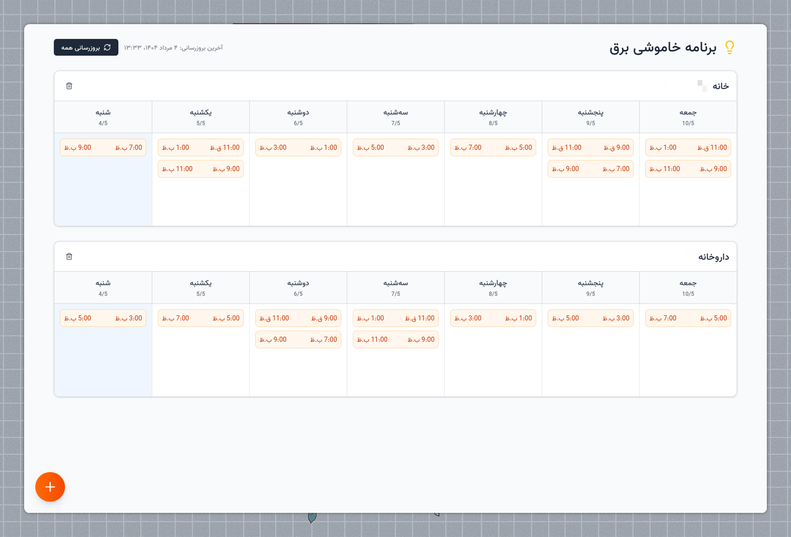

# Bargh-Man Blackout Notifier

[](https://github.com/yjavaherian/blackouts/actions/workflows/docker-publish.yml)

A simple, self-hosted web application to monitor planned electricity blackouts for any location in Iran, using data from the official "Bargh-e-Man" service. This tool helps you stay informed by providing a clean, fast, and user-friendly interface to view scheduled power outages.



## Features

- **Multi-Location Support:** Track planned blackouts for multiple locations (e.g., home, office) in one place.
- **Automatic Data Refresh:** Blackout data is automatically refreshed every 24 hours, ensuring you always have the latest information.
- **Manual Refresh:** A manual refresh option is available to fetch the latest data on demand.
- **Clean & Responsive UI:** A modern, mobile-friendly interface built with SvelteKit and Tailwind CSS.
- **Easy Deployment:** Deploy the entire application as a single Docker container.
- **Open Source:** The project is fully open-source and ready for community contributions.

## Getting Started: Deploy with Docker

The easiest way to get this application running is by using the pre-built Docker images from the GitHub Container Registry.

### Prerequisites

- [Docker](https://docs.docker.com/get-docker/) and [Docker Compose](https://docs.docker.com/compose/install/) installed on your server.

### 1. Create a `compose.yml` File

Create a file named `compose.yml` with the following content.

```yml
services:
  app:
    image: ghcr.io/yjavaherian/blackouts:main
    ports:
      - '127.0.0.1:3000:3000'
    volumes:
      - data:/app/data
    environment:
      - AUTH_TOKEN="your_actual_auth_token_here" # get it by inspecting network traffic on https://bargheman.com/profile/blackout/my-blackouts
      - DATABASE_URL=/app/data/sqlite.db
      - ORIGIN=http://localhost:3000
    restart: unless-stopped

volumes:
  data:
```

### 2. Run the Application

Start the application using Docker Compose:

```bash
docker compose up -d
```

Your personal blackout notifier will now be running and accessible at `http://localhost:3000`.

## Local Development

Interested in contributing? Here’s how to get the project running on your local machine.

### Prerequisites

- [Node.js](https://nodejs.org/) (v22 or newer)
- [pnpm](https://pnpm.io/installation)

### 1. Clone the Repository

```bash
git clone https://github.com/yjavaherian/blackouts.git
cd blackouts
```

### 2. Install Dependencies

```bash
pnpm install
```

### 3. Set Up Environment Variables

Copy the example environment file:

```bash
cp .env.example .env
```

Now, edit the `.env` file and add your `AUTH_TOKEN`.

### 4. Run the Development Server

The database will be created and configured automatically when you first start the app.

```bash
pnpm dev
```

The application will be available at `http://localhost:5173`.

## License

This project is licensed under the MIT License. See the [LICENSE](LICENSE) file for details.
